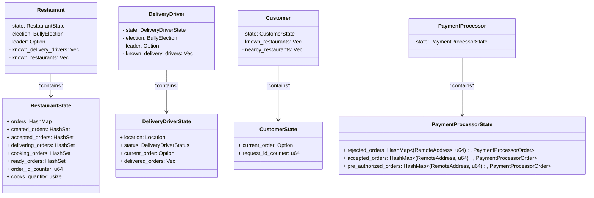

# REPOSITORIO DE MIS PROYECTOS ACADEMICOS  :D

```mermaid
classDiagram
    class Restaurant {
        - state: RestaurantState
        - election: BullyElection
        - leader: Option<RestaurantInfo>
        - known_delivery_drivers: Vec<AppIdentity>
        - known_restaurants: Vec<AppIdentity>
    }
    class DeliveryDriver {
        - state: DeliveryDriverState
        - election: BullyElection
        - leader: Option<DeliveryDriverInfo>
        - known_delivery_drivers: Vec<AppIdentity>
    }
    class Customer {
        - state: CustomerState
        - known_restaurants: Vec<AppIdentity>
        - nearby_restaurants: Vec<RestaurantInfo>
    }
    class PaymentProcessor {
        - state: PaymentProcessorState
    }

    class RestaurantState {
        + orders: HashMap<u64, RestaurantOrder>
        + created_orders: HashSet<u64>
        + accepted_orders: HashSet<u64>
        + delivering_orders: HashSet<u64>
        + cooking_orders: HashSet<u64>
        + ready_orders: HashSet<u64>
        + order_id_counter: u64
        + cooks_quantity: usize
    }

    class DeliveryDriverState {
        + location: Location
        + status: DeliveryDriverStatus
        + current_order: Option<DeliveryDriverOrder>
        + delivered_orders: Vec<DeliveryDriverOrder>
    }

    class CustomerState {
        + current_order: Option<CustomerOrder>
        + request_id_counter: u64
    }

    class PaymentProcessorState {
        + rejected_orders: HashMap<(RemoteAddress, u64), PaymentProcessorOrder>
        + accepted_orders: HashMap<(RemoteAddress, u64), PaymentProcessorOrder>
        + pre_authorized_orders: HashMap<(RemoteAddress, u64), PaymentProcessorOrder>
    }

    Restaurant --> RestaurantState : "contains"
    DeliveryDriver --> DeliveryDriverState : "contains"
    Customer --> CustomerState : "contains"
    PaymentProcessor --> PaymentProcessorState : "contains"
```
